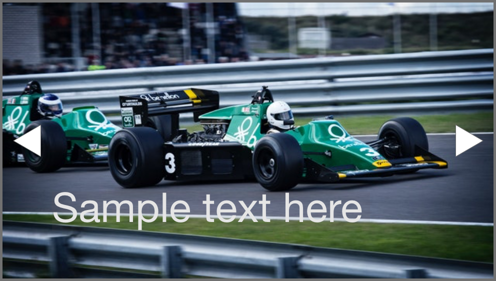

# Frontend Test

## Specification
Your task is to create a new JavaScript based image carousel widget. 

**Features:**
* Displays one image at the time
* Has navigation buttons (back, forward)
* If user clicks to one of the navigation button, the widget switches to the previous or next image
* Transition during image switching
* Optional: Widget switches between images periodically
* Optional: Displays text over the image

**Design example:**

**Rules:**
You can use any modern JavaScript framework you want. Do not use pre-implemented solution or npm module.

## Submit the solution
After the task is done, please provide us a public github reposiory url.

